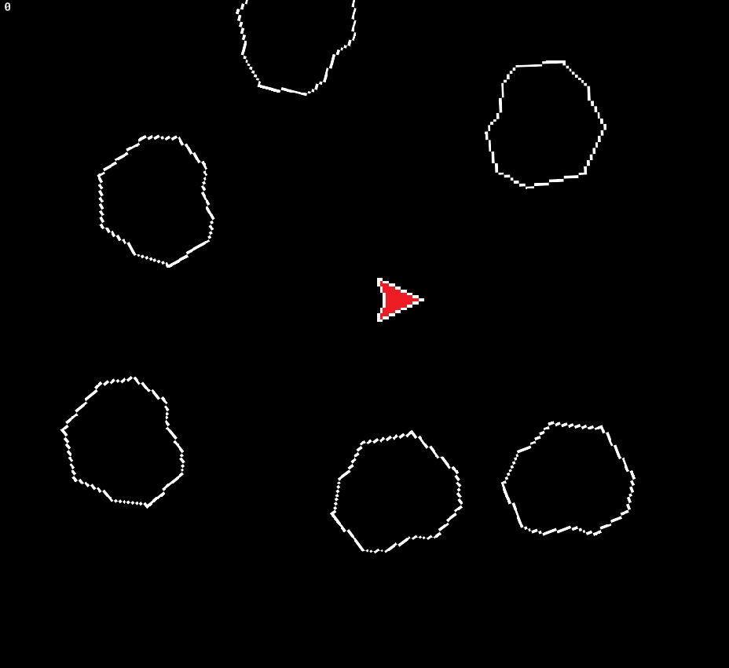

# Space Rocks

Proyek *arcade space shooter* pertama saya menggunakan GameMaker Studio 2! Saya membuat game ini sambil mengikuti tutorial dari GameMaker.io untuk mempelajari konsep dasar pengembangan game.

## Deskripsi

Dalam "Space Rocks", pemain mengendalikan pesawat luar angkasa dan harus menembak asteroid yang berdatangan. Ini adalah proyek pembelajaran yang sederhana, namun mencakup beberapa elemen penting dalam game arcade.

## Fitur

*   Kontrol pesawat yang responsif.
*   Sistem tembakan proyektil.
*   Efek ledakan sederhana saat asteroid hancur.
*   Sistem skor dasar.

## Cara Memainkan

*   **Bergerak:** Tombol panah Atas, Bawah, kiri dan kanan.
*   **Menembak:** Tombol Klik Kiri Mouse.

## Proses Pembuatan

Saya mengikuti tutorial langkah demi langkah dari GameMaker.io. Proses ini sangat membantu saya memahami:

*   Penggunaan *object* dan *instance* di GameMaker.
*   Penanganan *event* dan *action*.
*   Dasar-dasar pemrograman dengan GML.

## Teknologi yang Digunakan

*   GameMaker Studio 2
*   GML (GameMaker Language)
